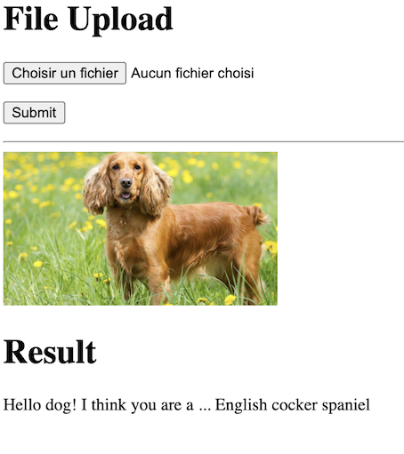

## Overview
This is a fork of Udacity's deep learning dog classification project. Original repository can be found at: https://github.com/udacity/deep-learning-v2-pytorch.git

This repository includes:
 - A simple web app that predicts the dog breed of a dog in an uploaded picture in dog_app/
 - A jupyter notebook model/dog_app.ipynb and its associated files used to develop and train 2 deep learning models for dog breed classification. Refer to model/README.md for further instructions.
 - A pdf export of the project notebook model/dog_app.pdf
 - The project proposal document: proposal.pdf
 - The project report: report.pdf
 
 ## Install
 ```
pip install -r requirements
```

## Run web app
In project root dir:
 ```
export FLASK_APP=dog_app
export FLASK_ENV=development
flask run
```

## Example

